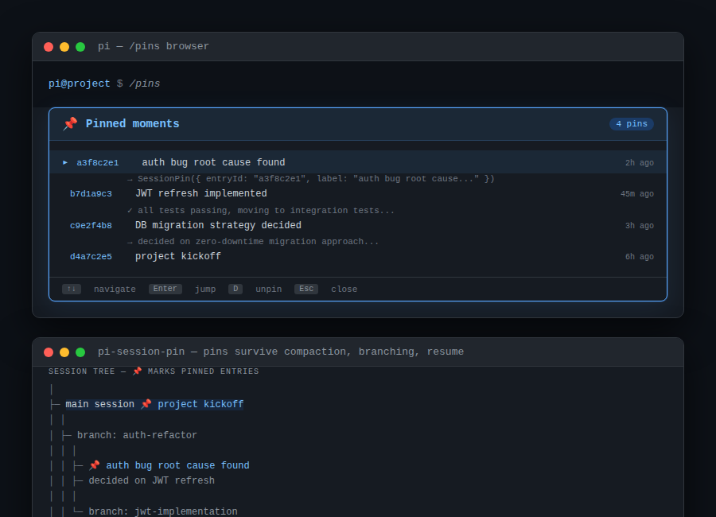

# pi-session-pin

> **Bookmark the moments worth remembering — not just the files.**



pi sessions are conversations, not just diffs. The turn where you found the auth bug, the exchange that unlocked the architecture, the moment you shipped the migration — all lost in session branching, compaction, and long conversations. pi-session-pin bookmarks them.

## Install

```bash
pi install git:github.com/Ola-Turmo/pi-session-pin
```

Restart pi to activate.

## Tools

**`SessionPin`** — pin any session entry by ID:

```
→ SessionPin({ entryId: "a3f8c2e1", label: "auth bug root cause found" })
```

**`SessionPins`** — list all pins in the session:

```
→ SessionPins({})
```

**`UnpinEntry`** — remove a pin (entry stays in session):

```
→ UnpinEntry({ entryId: "a3f8c2e1" })
```

**`UpdatePinLabel`** — change a pin's label:

```
→ UpdatePinLabel({ entryId: "a3f8c2e1", label: "fixed" })
```

## Commands

**`/pin <entry-id> [label]`** — quick pin from the prompt:

```
/pin abc123 auth bug root cause
/pin xyz789
```

**`/pins`** — open the pin browser:

```
↑↓  navigate   Enter  jump to entry   D  unpin   Esc  close
```

## How it works

Pins use two mechanisms:

1. **Session labels** — entries show a `📌` marker (or your custom label) in `/tree` output
2. **Custom session entries** — pin metadata persists through compaction and branching

Pins are session-scoped. A pin set in one branch only exists in that branch — resume, fork, or compact, the pin travels with you.

## Workflow tip

Start with a pin, end with a pin:

```
/pin <current-entry-id>  starting: implement JWT refresh
# ... do the work ...
/pin <completion-entry-id>  done: JWT refresh working, tests green
```

## Requirements

- pi v0.60.0+
- Node.js 18+

## Uninstall

```bash
pi uninstall git:github.com/Ola-Turmo/pi-session-pin
```

## License

MIT
